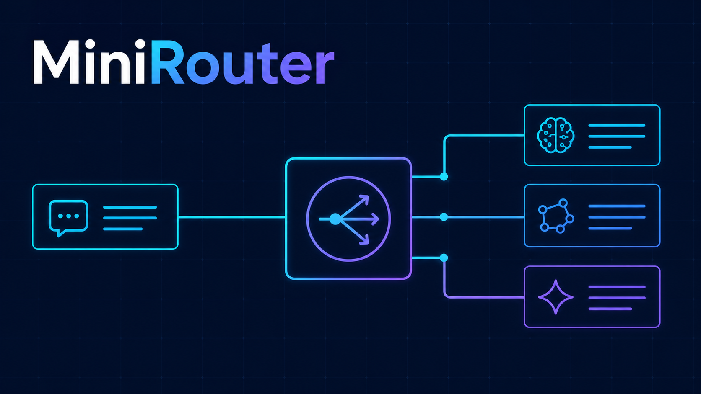

# MiniRouter



MiniRouter 是一个自托管的 LLM 智能调度网关。它不是简单转发 API，而是先判断
这次任务到底难不难，再决定该用快模型、均衡模型、强模型还是视觉模型——
让每个请求都跑到性价比最合适的模型上。

核心思路：**复杂任务保质量，简单任务省成本，而且每次路由都能解释。**

强模型当然好，但不该让"帮我改一句话"也消耗最贵的推理资源。

对使用者来说，仍然是一个统一 API——`model = minirouter/auto`，背后自动完成：

- **模型槽位选择** — 14 维规则分类器对提示词打分，映射到 SIMPLE / MEDIUM / COMPLEX / REASONING 四档
- **多渠道权重分流与故障冷却** — 同一槽位可挂多个渠道，加权轮询 + 失败自动转移
- **OpenAI / Anthropic 双兼容** — `/v1/chat/completions` 和 `/v1/messages` 两个入口，原生透传
- **API Key、用户额度与费用限制** — 多用户、多 Key、日 / 月额度管控
- **全链路记录** — 请求延迟、Token 用量、成本估算、路由原因全部入库可查
- **管理后台** — 可视化查看调用分布与模型表现

技术特性：

- **零运行时开销** — 所有路由逻辑本地执行，耗时 < 1 ms
- **无需外部数据库** — SQLite 自动迁移，开箱即用
- **原生透传** — 不做协议互转，各接口以各渠道原生格式进、原生格式出

## 路由原理

14 维规则分类器对用户提示词打分，然后映射到四个难度层级：

```
一句话总结、轻量改写 (SIMPLE)    → FAST 槽位      走性价比模型（如配置）
普通代码分析、工具调用 (MEDIUM)   → BALANCED 槽位  走均衡模型
复杂排查、深度推理 (COMPLEX)      → STRONG 槽位    自动切到强模型
数学证明、长上下文 (REASONING)    → STRONG 槽位    走最强模型
图片 / 多模态请求                 → VISION 槽位    走视觉模型
```

在 `.env` 中为每个槽位配置上游端点。MiniRouter 选好槽位后转发请求，仅此而已。

`POST /debug/route` 可以在不调用上游的情况下查看路由决策结果——每次路由都能解释。

## 快速开始（本地）

```bash
git clone https://github.com/lpffernando/MiniRouter.git
cd MiniRouter

# 1. 创建配置文件
cp .env.example .env
# 编辑 .env：替换每个槽位的 BASE_URL、API_KEY、MODEL

# 2. 安装并启动
npm ci
npm run build
npm start
# MiniRouter 监听 http://localhost:8402

# 3. 验证
curl http://localhost:8402/health/ready
# → { "status": "ready" }
```

`.env.example` 默认启用了 `MINIROUTER_SOLO=true`，本地请求无需 API key。
**切勿将 solo 模式暴露到不信任的网络。**

## 部署到服务器（Docker）

MiniRouter 使用两阶段 Docker 镜像。构建阶段从源码编译 better-sqlite3，
生产阶段是精简的 Node.js 22 容器。

### 方式 A — docker compose（推荐）

```bash
git clone https://github.com/lpffernando/MiniRouter.git
cd MiniRouter

# 1. 创建配置文件
cp .env.example .env
# 编辑 .env：替换每个槽位的 BASE_URL、API_KEY、MODEL

# 2.（可选）调整路由参数
#    编辑 .env.tuning — 默认值已经合理。

# 3. 构建并启动
docker compose up -d

# 4. 验证
curl http://localhost:8402/health/ready
# → { "status": "ready" }

# 5. 查看日志
docker compose logs -f
```

数据持久化在 `minirouter-data` Docker volume 中。如需通过 bind mount
让宿主机直接访问 SQLite 文件，编辑 `docker-compose.yml` 取消注释
`driver_opts` 块。

**国内构建：** 在 `docker-compose.yml` 中设置 build arg：

```yaml
args:
  USE_CHINA_MIRROR: "true"
  NPM_REGISTRY: "https://registry.npmmirror.com"
```

### 方式 B — 手动 docker run

```bash
# 构建（国内加 --build-arg USE_CHINA_MIRROR=true）
docker build -t minirouter:latest .

# 运行
docker run -d \
  --name minirouter \
  --restart unless-stopped \
  -p 8402:8402 \
  -v /opt/minirouter-data:/data \
  --env-file .env \
  minirouter:latest
```

### 方式 C — deploy.sh（本地构建，推送到服务器）

```bash
# 从本机构建镜像，scp 到服务器，重建容器
./deploy/deploy.sh your-server-ip 22

# 或直接在服务器上执行
./deploy/deploy.sh
```

### 配置文件

| 文件 | 用途 | 入库？ |
| --- | --- | :---: |
| `.env` | 密钥：API key、base URL、solo 模式 | 否（gitignored） |
| `.env.example` | 所有可用变量的模板 | 是 |
| `.env.tuning` | 路由参数默认值（无密钥） | 是 |

`.env.tuning` 会被打包进 Docker 镜像 `/app/.env.tuning`，提供合理的路由默认值。
运行时 `-e` 变量和 `.env` 的优先级均高于 `.env.tuning`。

### 生产环境首次启动

首次生产启动时，在 `.env` 中设置：

```env
MINIROUTER_SOLO=false
MINIROUTER_BOOTSTRAP_ADMIN_EMAIL=admin@example.com
```

MiniRouter 会创建一个超级管理员并在日志中打印一次性 API key。
**请立即保存，然后删除 `MINIROUTER_BOOTSTRAP_ADMIN_EMAIL`。**
使用 `Authorization: Bearer mr_sk_...` 调用管理 API 来创建用户和密钥。

### 反向代理（Nginx + TLS）

复制 Nginx 配置，替换域名，启用：

```bash
sudo cp deploy/nginx-minirouter.conf /etc/nginx/sites-available/minirouter
sudo sed -i 's/YOUR_DOMAIN.COM/your-actual-domain.com/g' /etc/nginx/sites-available/minirouter
sudo ln -s /etc/nginx/sites-available/minirouter /etc/nginx/sites-enabled/
sudo apt-get install -y certbot python3-certbot-nginx
sudo certbot --nginx -d your-domain.com
sudo systemctl reload nginx
```

### 更新部署

```bash
# 从本机
./deploy/deploy.sh your-server-ip

# 或在服务器上 git pull 后直接执行
./deploy/deploy.sh
```

重新构建镜像、停止旧容器、用相同 env/mount/port 启动新容器。

## API 使用

将 `model` 设为路由模型名，发送标准 OpenAI Chat Completions 请求：

```bash
curl -s http://localhost:8402/v1/chat/completions \
  -H 'Authorization: Bearer mr_sk_your_key' \
  -H 'Content-Type: application/json' \
  -d '{
    "model": "minirouter/auto",
    "messages": [{"role": "user", "content": "用一句话解释什么是 Kubernetes"}]
  }'
```

### 路由模型

| `model`                    | 行为                                   |
| -------------------------- | -------------------------------------- |
| `minirouter/auto`          | 自动分类，选择最优性价比槽位           |
| `minirouter/eco`           | 优先使用 balanced 槽位（成本优先）     |
| `minirouter/premium`       | 优先使用 strong 槽位（质量优先）       |
| `minirouter/slot/fast`     | 明确指定 fast 槽位（需配置）           |
| `minirouter/slot/balanced` | 明确指定 balanced 槽位                 |
| `minirouter/slot/strong`   | 明确指定 strong 槽位                   |
| `minirouter/slot/vision`   | 明确指定 vision 槽位                   |

### Tool Calling

```bash
curl -s http://localhost:8402/v1/chat/completions \
  -H 'Authorization: Bearer mr_sk_your_key' \
  -H 'Content-Type: application/json' \
  -d '{
    "model": "minirouter/auto",
    "messages": [{"role": "user", "content": "东京今天天气怎么样？"}],
    "tools": [{
      "type": "function",
      "function": {
        "name": "get_weather",
        "description": "获取指定城市的天气",
        "parameters": {
          "type": "object",
          "properties": { "city": { "type": "string" } },
          "required": ["city"]
        }
      }
    }]
  }'
```

当请求中包含 tools 时，路由器会自动切换到 agentic 路由模式，即使原本是简单请求也会
选择具备工具调用能力的高层级槽位。

### Anthropic Messages

```bash
curl -s http://localhost:8402/v1/messages \
  -H 'x-api-key: mr_sk_your_key' \
  -H 'anthropic-version: 2023-06-01' \
  -H 'Content-Type: application/json' \
  -d '{
    "model": "minirouter/auto",
    "max_tokens": 1024,
    "messages": [{"role": "user", "content": "你好，Claude。"}]
  }'
```

### 结构化输出 / JSON 模式

```bash
curl -s http://localhost:8402/v1/chat/completions \
  -H 'Authorization: Bearer mr_sk_your_key' \
  -H 'Content-Type: application/json' \
  -d '{
    "model": "minirouter/auto",
    "messages": [{"role": "user", "content": "列出 5 种狗品种"}],
    "response_format": { "type": "json_object" }
  }'
```

结构化输出请求会被强制至少路由到 MEDIUM 层级，避免 JSON 生成落到最弱模型。

### 调试路由（不调用上游）

```bash
curl -s http://localhost:8402/debug/route \
  -H 'Content-Type: application/json' \
  -d '{
    "model": "minirouter/auto",
    "messages": [{"role": "user", "content": "用 Rust 写一个斐波那契函数"}]
  }'
```

返回结果包括提取的层级、置信度、14 维评分、选中的槽位和回退链。

### 接口一览

| 接口                       | 认证     | 用途                     |
| -------------------------- | :------: | ------------------------ |
| `GET /health`              | 无       | 存活检查                 |
| `GET /health/ready`        | 无       | 槽位配置检查             |
| `GET /v1/models`           | key      | 可用路由模型和槽位列表   |
| `POST /v1/chat/completions`| key      | OpenAI 兼容聊天           |
| `POST /v1/messages`        | key      | Anthropic 消息            |
| `POST /debug/route`        | 无（本地）| 路由调试，不调用上游     |
| `GET /admin/dashboard`     | admin    | 管理仪表盘（HTML）       |
| `GET /admin/overview`      | admin    | 用量概览（JSON）         |
| `GET /api/usage/logs`      | admin    | 查询用量日志             |
| `GET /api/usage/summary`   | admin    | 按用户/模型用量汇总      |

## 智能体接入

MiniRouter 可以作为任何 LLM 编码智能体的 API 代理。将智能体的 base URL 指向
MiniRouter 并使用路由模型作为 model 名称。

### Claude Code

Claude Code 使用原生 Anthropic Messages API。指向 MiniRouter 的 `/v1/messages`：

```bash
export ANTHROPIC_BASE_URL="http://localhost:8402/v1/messages"
export ANTHROPIC_API_KEY="mr_sk_your_key"
claude
```

所有 Claude Code 功能（tool use、流式输出、extended thinking）都透明透传。
通过路由模型控制槽位选择：

```bash
# 强制使用 strong 槽位
claude --model minirouter/premium

# 单次调用
claude -p "优化这个 React 组件" --model minirouter/auto
```

### Codex CLI

OpenAI Codex CLI 使用 OpenAI Chat Completions API：

```bash
export OPENAI_BASE_URL="http://localhost:8402/v1"
export OPENAI_API_KEY="mr_sk_your_key"
codex --model minirouter/auto
```

Tool calling、流式输出、推理功能全部兼容。路由器会自动检测函数调用并路由到
支持工具的槽位。

### OpenCode

OpenCode 是 OpenAI 兼容的编码智能体：

```bash
export OPENAI_BASE_URL="http://localhost:8402/v1"
export OPENAI_API_KEY="mr_sk_your_key"
opencode --model minirouter/auto
```

### Pi（编码智能体框架）

Pi 同时支持 OpenAI 和 Anthropic 后端。OpenAI 兼容模式：

```bash
export OPENAI_BASE_URL="http://localhost:8402/v1"
export OPENAI_API_KEY="mr_sk_your_key"
pi --model minirouter/auto
```

Anthropic 兼容模式：

```bash
export ANTHROPIC_BASE_URL="http://localhost:8402/v1/messages"
export ANTHROPIC_API_KEY="mr_sk_your_key"
pi --model minirouter/auto
```

### Aider

```bash
aider --openai-api-base http://localhost:8402/v1 \
      --model openai/minirouter/auto \
      --api-key mr_sk_your_key
```

或者通过环境变量：

```bash
export OPENAI_API_BASE="http://localhost:8402/v1"
export OPENAI_API_KEY="mr_sk_your_key"
aider --model openai/minirouter/auto
```

### Cursor / VS Code

在 Cursor 或 VS Code 设置中添加自定义 OpenAI 兼容 Provider：

```json
{
  "cursor.apiKey": "mr_sk_your_key",
  "cursor.openaiBaseUrl": "http://localhost:8402/v1",
  "cursor.models": ["minirouter/auto", "minirouter/premium"]
}
```

### 任意 OpenAI 兼容客户端

只要支持自定义 OpenAI 端点的工具都能用：

```bash
export OPENAI_BASE_URL="http://localhost:8402/v1"
export OPENAI_API_KEY="mr_sk_your_key"
export OPENAI_MODEL="minirouter/auto"
```

### 编码智能体路由建议

| 场景               | 推荐模型                   | 说明                     |
| ------------------ | -------------------------- | ------------------------ |
| 聊天 / 提问        | `minirouter/auto`          | 由路由器自动判断         |
| 代码生成           | `minirouter/auto`          | 自动检测复杂度           |
| 大规模重构         | `minirouter/premium`       | 强制使用 strong 槽位     |
| 快速编辑 / 补全    | `minirouter/eco`           | 快速便宜的模型           |
| 图片 / 截图处理    | `minirouter/slot/vision`   | 视觉能力模型             |

> **提示：** 在本地开发模式（`MINIROUTER_SOLO=true`）下，可以省略 API key，
> 智能体无需认证即可工作。

## 配置参考

所有配置在 `.env` 中。复制 `.env.example` 到 `.env` 并替换占位符。

### 必需槽位

至少需要配置 `balanced`、`strong`、`vision` 三个槽位，`/health/ready` 才会通过。
`fast` 是可选槽位。

| 变量                                 | 说明                                     |
| ------------------------------------ | ---------------------------------------- |
| `MINIROUTER_{SLOT}_PROVIDER`         | `openai-compatible`、`anthropic` 或留空自动检测 |
| `MINIROUTER_{SLOT}_BASE_URL`         | 上游 API 端点                             |
| `MINIROUTER_{SLOT}_API_KEY`          | 提供商认证密钥                            |
| `MINIROUTER_{SLOT}_MODEL`            | 上游期望的模型名称                        |
| `MINIROUTER_{SLOT}_SUPPORTS_TOOLS`   | `true` / `false`                          |
| `MINIROUTER_{SLOT}_SUPPORTS_VISION`  | `true` / `false`                          |
| `MINIROUTER_{SLOT}_CONTEXT_WINDOW`   | 最大上下文窗口（token）                   |

### 路由调参（可选，内置合理默认值）

| 变量                                   | 默认值   | 说明                                   |
| -------------------------------------- | :------: | -------------------------------------- |
| `MINIROUTER_BOUNDARY_SIMPLE_MEDIUM`    | `0.10`   | SIMPLE / MEDIUM 分界线                  |
| `MINIROUTER_BOUNDARY_MEDIUM_COMPLEX`   | `0.3`    | MEDIUM / COMPLEX 分界线                 |
| `MINIROUTER_BOUNDARY_COMPLEX_REASONING`| `0.5`    | COMPLEX / REASONING 分界线              |
| `MINIROUTER_TOKEN_COUNT_SIMPLE`        | `50`     | token 数 ≤ 此值 → 向 SIMPLE 倾斜        |
| `MINIROUTER_TOKEN_COUNT_COMPLEX`       | `500`    | token 数 ≥ 此值 → 向 COMPLEX 倾斜       |
| `MINIROUTER_CONFIDENCE_THRESHOLD`      | `0.55`   | 低于此置信度 → 回退到模糊层级           |
| `MINIROUTER_CONFIDENCE_STEEPNESS`      | `12`     | 置信度 sigmoid 的陡峭度                 |
| `MINIROUTER_AMBIGUOUS_DEFAULT_TIER`    | `MEDIUM` | 低置信度时的回退层级                    |
| `MINIROUTER_STRUCTURED_OUTPUT_MIN_TIER`| `SIMPLE` | JSON/tool_choice 请求的最低层级         |
| `MINIROUTER_AGENTIC_SCORE_THRESHOLD`   | `0.5`    | agentic 维度阈值，触发 agentic 路由     |
| `MINIROUTER_AGENTIC_MODE`              | —        | 强制 agentic 模式：`true` / `false`（不设置则自动检测） |
| `MINIROUTER_DIMENSION_WEIGHTS`         | —        | JSON 对象，覆盖 14 个维度权重          |

### 上下文优化（可选，默认关闭）

| 变量                                     | 默认值    | 说明                               |
| ---------------------------------------- | :------: | ---------------------------------- |
| `MINIROUTER_HEADROOM_ENABLED`            | `false`  | 启用外部 Headroom 服务             |
| `MINIROUTER_HEADROOM_MODE`               | `adaptive`| `off` / `adaptive` / `force`      |
| `MINIROUTER_HEADROOM_URL`                | —        | Headroom API 端点                  |
| `MINIROUTER_HEADROOM_MIN_TOKENS`         | `8000`   | 触发 Headroom 的最小 token 数      |
| `MINIROUTER_HEADROOM_CONTEXT_RATIO`      | `0.85`   | 上下文窗口填充比例触发阈值         |
| `MINIROUTER_TAIL_COMPRESSION_ENABLED`    | `false`  | 本地尾部压缩                       |
| `MINIROUTER_TAIL_COMPRESSION_MIN_CHARS`  | `12000`  | 触发压缩的最小字符数               |
| `MINIROUTER_TAIL_COMPRESSION_MAX_CHARS`  | `2000`   | 压缩后的目标字符数                 |

### 其他

| 变量                       | 默认值                       | 说明                           |
| -------------------------- | :--------------------------: | ------------------------------ |
| `MINIROUTER_SOLO`          | `true`                       | 跳过 API key 认证（本地开发）  |
| `MINIROUTER_PORT`          | `8402`                       | HTTP 监听端口                  |
| `MINIROUTER_CNY_PER_USD`   | `7.2`                        | 人民币/美元汇率（成本统计用）  |
| `MINIROUTER_DEBUG_LOG`     | `false`                      | 打印额外诊断信息到 stdout      |
| `MINIROUTER_DB`            | `~/.minirouter/minirouter.db`| 覆盖 SQLite 数据库路径         |
| `MINIROUTER_USER`          | `minirouter`                 | 系统用户名（仅部署脚本用）     |
| `MINIROUTER_BRANCH`        | `main`                       | Git 分支（仅部署脚本用）       |

## 查询数据库

MiniRouter 将所有数据存储在 SQLite 中，路径为 `~/.minirouter/minirouter.db`。

```bash
# 今日看板（在项目根目录执行）
node scripts/today.mjs

# 交互式查询
export MINIROUTER_DB="$HOME/.minirouter/minirouter.db"
node -e "
  const D=require('better-sqlite3');
  const d=new D(process.env.MINIROUTER_DB,{readonly:true});
  console.table(d.prepare(\`
    SELECT created_at, tier, model, status,
           input_tokens, output_tokens
    FROM usage_logs ORDER BY created_at DESC LIMIT 20
  \`).all())
"
```

更多查询技巧见 [docs/db-queries.md](docs/db-queries.md)。

## 模型评分仪表盘

MiniRouter 内置了一个可搜索的模型对比表，访问 `/models/dashboard`。首次使用前导入数据：

```bash
npm run seed:models
```

这会将 `models/seed-data.json` 中的定价和基准测试数据写入 SQLite 数据库。
种子数据是手动导入的，重启不会覆盖本地修改。

## 开发

```bash
npm ci
npm run typecheck
npm test
npm run lint
npm run build
```

## 文档

- [路由概览与 MVP](docs/routing-mvp.md)
- [路由策略](docs/routing-strategy.md)
- [基础设施管理设计](docs/infra-management-design.md)
- [数据库查询指南](docs/db-queries.md)
- [环境变量参考](.env.example)
- [安全策略](SECURITY.md)
- [贡献指南](CONTRIBUTING.md)

## 许可证

[MIT](LICENSE)